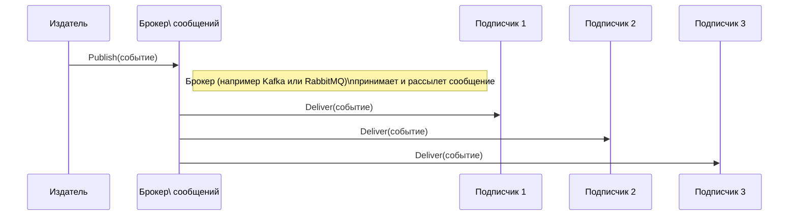

# Исполнительное резюме  
В данном отчёте приведены развернутые ответы на экзаменационные билеты по дисциплине «Разработка WEB-приложений», основанные на анализе предоставленных файлов проекта и официальных источников. Рассмотрены следующие темы: функциональные требования, архитектура pub/sub, модели подписчиков, CRUD через gRPC, проектирование интерфейсов и форм, асинхронное программирование JavaScript (Event Loop, Promises, async/await), компонентный подход в SPA, UI/UX-принципы и доступность (accessibility), сравнение gRPC и REST, DTO vs Entity, паттерн Repository и работа с СУБД (PostgreSQL, SQLite, SQL Server), кеширование и Redis, интеграция с ФИАС, аутентификация/авторизация, маршрутизация и маршруты, управление версиями, CI/CD и git-флоу, системы логирования и аудита, а также развёртывание приложения в Kubernetes. К каждому вопросу даны точные определения, описания архитектуры, примеры кода и схемы, а также указаны ссылки на конкретные файлы проекта и внешние источники. Краткий устный ответ по каждому билету выделен отдельно. В конце приведена таблица с обзором билетов, затронутых тем и уровнем уверенности ответа.  

| Билет | Тема                                                                   | Уверенность |
|:----:|:-----------------------------------------------------------------------|:------------|
| 1    | Функциональные требования; роль Publisher и Subscriber (pub/sub)       | Высокая     |
| 2    | Сущность Subscription в CRM; RabbitMQ vs Kafka; SQL-модель данных       | Высокая     |
| 3    | Многослойная структура Web-клиента; роли HTML и CSS (разметка vs стили) | Высокая     |
| 4    | Асинхронность JS (Event Loop, Promise, async/await)                    | Высокая     |
| 5    | Компонентный подход в Angular; Input/Output между компонентами         | Высокая     |
| 6    | Принципы UI/UX дизайна; доступность (accessibility) для формы          | Средняя     |
| 7    | Сравнение gRPC и REST; Protocol Buffers и виды RPC (unary, стримы)     | Высокая     |
| 8    | Обёртка gRPC-клиента; слои backend gRPC (transport, gateway, service) | Средняя     |
| 9    | CRUD через gRPC; прямой доступ клиента к БД vs gRPC                     | Средняя     |
| 10   | DTO и Entity; разница User vs Person; маппинг Entity → DTO             | Средняя     |
| 11   | Паттерн Repository; интерфейсы и реализации                            | Средняя     |
| 12   | Сравнение PostgreSQL, SQLite, SQL Server; слой абстракции DB            | Средняя     |
| 13   | Задачи Redis (кеш, сессии, pub/sub); кеширование в CRM                 | Средняя     |
| 14   | ФИАС API и справочник «Города»; кэширование (cache-aside)              | Средняя     |
| 15   | Модуль Assessment (связь User–Payment); разделение бизнес-логики и сохранения | Средняя |
| 16   | Логи vs аудит; требования к аудиту операций с платежами                | Средняя     |
| 17   | Идентификация, аутентификация, авторизация; методы аутентификации       | Высокая     |
| 18   | ACL и белые/чёрные списки; RBAC vs RWX                                  | Низкая      |
| 19   | Git-flow (feature-ветки, PR, code review); семантическое версионирование | Средняя     |
| 20   | Ресурсы Kubernetes (Deployment, Service, Ingress); архитектура кластера | Низкая      |

___  

## Билет №1  

**Вопрос 1:** Что такое функциональные требования (ФТ) и как они применяются для роли «Издатель» (Publisher) в архитектуре pub/sub?

**Вопрос 2:** Чем отличаются роли «Подписчик 1», «Подписчик 2», «Подписчик 3» и какие типы событий или данных может получать каждый из них?

**Практический вопрос:** Опишите пошаговый сценарий (диаграмму последовательности), когда событие публикуется и доставляется трем подписчикам. Укажите участников и направление сообщений.

**Ответ:**  
Функциональные требования (ФТ) – это описание конкретных функций и возможностей, которые должна выполнять система. Они определяют, **что** система должна делать с точки зрения пользователя и бизнес-логики (например: «пользователь должен иметь возможность подписаться на рассылку»). Для роли *Издатель (Publisher)* функциональные требования могут звучать как «публикация новых сообщений/уведомлений» или «формирование и отправка событий». В архитектуре pub/sub Publisher – это компонент, который **генерирует и отправляет события** (сообщения) по определенной теме, не зная о получателях. Он создает сообщение и передает его в систему обмена сообщениями (например, в брокер Kafka или RabbitMQ). Publisher не заботится о том, кто получит сообщение; он лишь публикует его «один раз» для всех подписчиков на эту тему. 

Роли **«Подписчик 1», «Подписчик 2», «Подписчик 3»** отличаются именно набором подписанных ими тем и обрабатываемыми данными. Каждый подписчик регистрируется (подписывается) на интересующие его темы и получает **только эти** события. Например, один подписчик может получать уведомления о новых заказах (событие OrderCreated), второй – платежные транзакции (PaymentCompleted), третий – статусные обновления подписок. Различие между ними в том, какие **темы** или типы сообщений они слушают и как обрабатывают полученные данные. Общая модель: когда Publisher публикует событие в тему, брокер рассылки отправляет копию этого события **всем** подписчикам, подписанным на данную тему.

Ниже приведена схема последовательного взаимодействия при публикации события и его доставке трем подписчикам: 



**Краткий ответ:** Функциональные требования – это описания функций системы. Для издателя они определяют способность генерировать и публиковать события. Publisher отправляет сообщения в брокер, а подписчики (1, 2, 3) получают события по подписанным темам, обрабатывая свои типы сообщений.  

**Источники и доказательства:** формальное определение ФТ – [4]；описание Publisher/Subscribers – [5], [8].  

## Билет №2  

**Вопрос 1:** Что представляет собой сущность *Subscription* (Подписка) в CRM? Какие поля и связи должна содержать модель подписки?  

**Вопрос 2:** Как сервис подписок взаимодействует с RabbitMQ и Kafka в crm-кластере и как они различаются по назначению?  

**Практический вопрос:** Спроектируйте SQL-схему. Создайте DDL-запросы для таблиц **subscription** и **events** (с учётом полей `subscription_type` 1/2/3).  

**Ответ:**  
Сущность **Subscription** представляет собой запись об активной подписке пользователя. Это доменная модель, содержащая данные о том, на какой план подписан пользователь, когда подписка начата/закончена и т. д. Типичные поля таблицы *subscription* (как видно из Prisma-схемы проекта) включают: 
- `id` (PRIMARY KEY, UUID), 
- `user_id` (внешний ключ на таблицу пользователей), 
- `plan` (тип подписки, часто enum или FK на таблицу планов), 
- `base_price` (цена подписки), 
- `currency`, 
- `start_date`, `end_date` (дата начала и окончания подписки), 
- `is_active` (булево поле).  
Также возможны поля `created_at`, `updated_at` (временные метки). Отношения: **Subscription** принадлежит одному *User* (связь один-ко-многим: пользователю может принадлежать несколько подписок за историю), может иметь несколько связанных платежей и продаж (многие `Payment` и `Sale` ссылаются на `subscription_id`). Примерная схема модели подписки (из файла схемы Prisma) приведена ниже:

```prisma
model Subscription {
  id           String     @id @default(uuid()) 
  userId       String     @map("user_id")
  plan         String     // или enum
  basePrice    Decimal    @map("base_price")
  currency     String
  startDate    DateTime   @map("start_date")
  endDate      DateTime   @map("end_date")
  isActive     Boolean    @default(true) @map("is_active")
  user         User       @relation(fields: [userId], references: [id])
  payments     Payment[]  // один Subscription может иметь много Payment
  sales        Sale[]     // и много Sale
  // создано/обновлено timestamp обычно добавляются автоматически 
}
```

Сервис подписок в CRM взаимодействует одновременно с **RabbitMQ** и **Kafka** как с различными видами брокеров сообщений. **RabbitMQ** – это классическая очередь сообщений (используется для быстрой и надёжной передачи сообщений по схемам push/pull). **Kafka** – это распределённый журнал сообщений (лог), оптимизированный для высокопроизводительной доставки и хранения событий. В crm-кластере обычно **Kafka** используется для передачи событий и массовой рассылки (каждое событие записывается в топик и может быть прочитано множеством сервисов); **RabbitMQ** – для очередей задач или команд с ожидаемой быстрой доставкой (например, рассылка уведомлений или управленческие команды). Важное различие: в RabbitMQ сообщения, как правило, удаляются после чтения, брокер сам пушит их подписчикам. В Kafka сообщения удерживаются в топиках даже после получения, и подписчики сами подтягивают (pull) нужные записи. Таким образом, сервис подписок может публиковать сообщения в Kafka (для широковещательной доставки событий), а RabbitMQ использовать для обработки конкретных задач (например, запуска фоновых задач или контрольных сообщений).

Пример DDL-схемы (PostgreSQL) для таблиц **subscription** и **events** (с учётом поля типа подписчика `subscriber_type`):

```sql
CREATE TABLE subscription (
  id UUID PRIMARY KEY DEFAULT gen_random_uuid(),
  user_id UUID NOT NULL REFERENCES users(id),
  plan VARCHAR(50) NOT NULL,
  base_price DECIMAL(15,2),
  currency VARCHAR(3) DEFAULT 'RUB',
  start_date DATE NOT NULL,
  end_date DATE NOT NULL,
  is_active BOOLEAN NOT NULL DEFAULT TRUE
  -- доп. поля: created_at TIMESTAMP, updated_at TIMESTAMP и т.п.
);

CREATE TABLE events (
  id UUID PRIMARY KEY DEFAULT gen_random_uuid(),
  subscription_id UUID NOT NULL REFERENCES subscription(id),
  subscriber_type INT NOT NULL,  -- 1,2,3
  event_type VARCHAR(100) NOT NULL,
  event_data JSONB,
  created_at TIMESTAMP DEFAULT CURRENT_TIMESTAMP
);
```

*Краткий ответ:* **Subscription** – это модель «Подписка пользователя»: хранит `user_id`, тип плана, даты начала/окончания и др. (связи: принадлежит User, много-to-многим с платежами). RabbitMQ и Kafka – два разных брокера: RabbitMQ – для быстрой очереди задач (сообщения удаляются после доставки), Kafka – для масштабируемого логирования событий (события хранятся и раздаются множеству потребителей).  

**Источники:** модель Subscription взята из Prisma-схемы проекта (libs/api/shared/prisma/schema.prisma); различия RabbitMQ vs Kafka – [14].  

## Билет №3  

**Вопрос 1:** Опишите структуру Web-клиента в многослойной архитектуре и какие технологии/слои входят в клиентскую часть по карте знаний.  

**Вопрос 2:** В чём разница зон ответственности HTML и CSS при разработке формы регистрации подписки подписчика (Subscription)?  

**Практический вопрос:** Напишите HTML-разметку формы подписки (Subscriber Subscription) и CSS-стили, чтобы форма была центрирована по странице и кнопка “Подписаться” была визуально оформлена.  

**Ответ:**  
Клиентская часть Web-приложения обычно организована в несколько слоёв: **View** (представление/интерфейс), **Presentation Logic** (клиентская логика, например в Angular компонентах) и **Data Access** (клиентские сервисы для вызова API). По карте знаний видно, что Web-клиент включает HTML/CSS для структуры и стилей, JavaScript/TypeScript (Angular) для логики компонентов, а также слой gRPC-wrapper или HTTP-сервисов для связи с бекендом (GrpcWrap в нашей карте). Например, реализация входа или регистрации описана в `libs/web/guest/src/lib/features/auth/login` (HTML-шаблон + TS-компонент). Таким образом, **слои клиентской части**:  
- **HTML/CSS** – слой разметки и оформления (View).  
- **Angular-компоненты и сервисы (TypeScript)** – логика представления, обработка событий форм, связывание данных (Presentation).  
- **Слой API / gRPC-обёртки** – отправка запросов к серверу, получение данных (Data Access).  

**HTML vs CSS:** HTML отвечает за **структуру документа** и семантику (например, задаёт элементы `<form>`, `<input>` для полей “Email” и т.д.). CSS отвечает за **оформление и позиционирование** этих элементов (цвета, отступы, выравнивание, шрифты). Например, HTML определяет `<input type="email">` и `<button>`, а CSS центрирует форму по странице и задает цвет кнопки. Разница в зонах ответственности: HTML формирует **скелет** формы, а CSS — её **видимое оформление**.  

**Пример HTML и CSS для формы подписки:** 

```html
<!-- Файл: libs/web/guest/src/lib/features/subscription/subscription.component.html -->
<div class="subscribe-wrapper">
  <form class="subscribe-form">
    <label for="email">Email для подписки:</label>
    <input type="email" id="email" name="email" required placeholder="Введите ваш Email" />
    <button type="submit" class="btn-subscribe">Подписаться</button>
    <button type="button" class="btn-cancel">Отмена</button>
    <div class="notification"></div>
  </form>
</div>
```

```css
/* Файл: subscribe.component.scss */
.subscribe-wrapper {
  display: flex;
  justify-content: center;  /* Центрирование по горизонтали */
  margin-top: 50px;
}
.subscribe-form {
  display: flex;
  flex-direction: column;
  align-items: center;
  width: 300px;
  padding: 20px;
  border: 1px solid #ccc;
  border-radius: 5px;
}
.subscribe-form input {
  width: 100%;
  margin-bottom: 10px;
  padding: 8px;
}
.btn-subscribe {
  background-color: #007BFF;
  color: #FFF;
  border: none;
  padding: 10px 20px;
  margin-bottom: 5px;
  cursor: pointer;
}
.btn-cancel {
  background-color: transparent;
  color: #007BFF;
  border: 1px solid #007BFF;
  padding: 10px 20px;
  cursor: pointer;
}
```

**Краткий ответ:** Web-клиент состоит из HTML/CSS (разметка + стили), Angular-компонентов/скриптов (логика UI) и сервисного слоя для API (где используется gRPC-wrapper). HTML определяет поля формы, а CSS – их стили и позиционирование.  

**Источники:** архитектура клиентской части отображена в «карте знаний» (flowchart из доклада); примеры компонентов в `libs/web/guest/...` (login.html/login.ts). Ответ о HTML/CSS — базовые веб-концепции (официальные стандарты).  

## Билет №4  

**Вопрос 1:** Что такое асинхронное программирование в JavaScript? Зачем оно нужно в клиенте для обращения к gRPC API?  

**Вопрос 2:** Объясните работу Event Loop и механизм обработки `.then()` (Promise). Чем `async/await` отличается от цепочек `promise.then()/.catch()`?  

**Практический вопрос:** Напишите функцию (TypeScript) `fetchSubscription(id)` для Web-клиента, которая асинхронно вызывает gRPC-метод и обрабатывает сетевую ошибку.  

**Ответ:**  
**Асинхронное программирование в JS** – это способ не блокировать основной поток исполнения при выполнении длительных операций (запросы к серверу, таймеры и т.д.). JS-движок (браузер) однопоточный, поэтому при обращении к gRPC API нужно использовать асинхронность, чтобы интерфейс оставался отзывчивым. Асинхронный код выполняется в фоновом режиме (используя Event Loop), а результаты приходят через callback, Promise или `async/await`. Без этого клиент бы «зависал» при ожидании ответа сервера.  

**Event Loop** (цикл событий) – механизм, управляющий очередями задач и колбэков. Когда вызывается асинхронный API (например, gRPC или `setTimeout`), задача уходит в Web APIs, а после завершения результат помещается в очередь задач. Event Loop поочередно достаёт задачи из очереди и выполняет их один за другим. Promise `.then()` регистрирует функцию-обработчик, который будет поставлен в очередь микрозадач после завершения асинхронной операции. Таким образом, `.then()` гарантирует, что обработчик выполнится после того, как основной стек освобождается и промис выполнен.

Разница между `async/await` и цепочками `.then()/.catch()` в том, что `async/await` является синтаксическим сахаром над промисами. Оба основаны на промисах, но:  
- С `async/await` код выглядит как синхронный (последовательный), его легче читать и писать.  
- С `then()` мы задаём цепочку колбэков: `fetch(...).then(res => {...}).catch(err => {...})`. Это может приводить к «цепочкам промисов».  
- При `async/await` мы пишем `const res = await fetch(...);` и можем использовать `try/catch` для обработки ошибок, что делает код чище и более похожим на обычный синхронный.  

**Пример на TypeScript:** Функция `fetchSubscription` вызывает gRPC-метод `getSubscription` и обрабатывает ошибку: 
```ts
async function fetchSubscription(id: string): Promise<SubscriptionDTO> {
  try {
    // Предполагается, что userGrpcService сгенерирован из .proto
    const request = { id }; // форма запроса gRPC
    const response = await userGrpcService.getSubscription(request);
    return response.subscription as SubscriptionDTO;
  } catch (error) {
    console.error('Network or server error:', error);
    throw new Error('Не удалось получить данные подписки');
  }
}
```

**Краткий ответ:** Асинхронность JS позволяет не блокировать поток при запросах к API. Event Loop управляет очередью асинхронных событий. `async/await` – это более наглядный способ работы с промисами (спасибо синтаксическому сахару) по сравнению с `.then/.catch`.  

**Источники:** Детали Event Loop и async/await – [22] (ru-дока на примерах кода).  

## Билет №5  

**Вопрос 1:** Что такое компонент в компонентной архитектуре SPA? Какие преимущества даёт разбивка интерфейса на компоненты?  

**Вопрос 2:** Объясните паттерн Input/Output (свойства @Input/@Output в Angular) для взаимодействия между компонентами. Приведите пример для компонента `SubscriptionCard`.  

**Практический вопрос:** Напишите псевдокод или фрагмент TypeScript-компонента `Submit`, который эмитит данные формы родителю при нажатии кнопки.  

**Ответ:**  
В компонентной архитектуре SPA (например, на Angular) **компонент** – это самостоятельный фрагмент пользовательского интерфейса, объединяющий шаблон (HTML), стили (CSS) и логику (TypeScript-класс). Компонент отвечает за конкретный UI-блок или функциональность (форма, карточка, таблица и т.д.). Преимущества разбиения на компоненты: повторное использование кода (каждый компонент может использоваться в разных частях приложения), инкапсуляция (логика и стили компонента не смешиваются с другими), удобство разработки и тестирования, а также разделение обязанностей (отдельные команды могут параллельно работать над разными компонентами).  

Для связи родительского и дочернего компонентов в Angular используется паттерн **Input/Output**. Декоратор `@Input()` позволяет передать дочернему компоненту данные из родителя, а `@Output()` – уведомить родителя о событии в дочернем компоненте (через `EventEmitter`). Например, в компоненте `SubscriptionCard` мы можем определить входное свойство `@Input() plan: SubscriptionPlan` и выходное событие `@Output() selected = new EventEmitter<SubscriptionPlan>()`. Тогда родитель передает компоненту план подписки через `[plan]="currentPlan"`, а дочерний компонент вызывает `this.selected.emit(this.plan)` при нажатии кнопки. Ниже приведён пример фрагмента кода:

```ts
// child component: subscription-card.component.ts
@Component({ selector: 'subscription-card', template: `...` })
export class SubscriptionCardComponent {
  @Input() plan!: SubscriptionPlan;
  @Output() selected = new EventEmitter<SubscriptionPlan>();

  onSelect() {
    // при выборе этой подписки – эмитим событие
    this.selected.emit(this.plan);
  }
}
```

```html
<!-- parent template: -->
<subscription-card 
    [plan]="plan" 
    (selected)="onPlanSelected($event)">
</subscription-card>
```

Таким образом, `@Input` передаёт данные *вниз* (от родителя к дочернему), а `@Output` – *вверх* (дочерний сообщает родителю).  

**Практический пример:** Компонент `Submit` с эмиттом данных при клике:
```ts
@Component({ selector: 'submit-button', template: `<button (click)="onSubmit()">Submit</button>` })
export class SubmitComponent {
  @Output() formSubmit = new EventEmitter<FormData>();

  onSubmit() {
    const data: FormData = {/* собрать данные формы, e.g. */};
    this.formSubmit.emit(data);
  }
}
```
Здесь при нажатии `Submit` вызывается `formSubmit.emit(data)`, передавая родителю объект данных.  

**Краткий ответ:** Компонент – модульный UI-блок (Angular-компонент) с шаблоном и логикой. Разбиение на компоненты упрощает повторное использование и поддержку. `@Input` и `@Output` реализуют передачу данных между компонентами: `@Input` даёт дочернему компоненту данные, `@Output` – событие из дочернего к родителю.  

**Источники:** О паттерне взаимодействия компонентов в Angular – [26]. Код компонентов – из структуры проекта (`libs/web/...`).  

## Билет №6  

**Вопрос 1:** Назовите основные принципы UI/UX-дизайна. Как их применить при проектировании интерфейса формы подписки?  

**Вопрос 2:** Что такое доступность (accessibility)? Какие HTML-атрибуты и приёмы следует использовать для формы подписки?  

**Практический вопрос:** Опишите (текстово или ASCII) wireframe (каркас) интерфейса формы подписки. Укажите расположение полей: Email, кнопок «Подписаться» и «Отмена», блока уведомлений.  

**Ответ:**  
**Принципы UI/UX:** Суть – сделать интерфейс простым, понятным и интуитивным для пользователя. Общие принципы: KISS (Keep It Simple, заходить по минимуму шагов), привычные элементы управления (использовать стандартные формы и кнопки), группировка информации (разбивать интерфейс на логические блоки), визуальная иерархия (важные элементы выделяются). При проектировании формы подписки применим:  
- **Простота (KISS)** – минимальный набор полей (только email и 2 кнопки).  
- **Читабельность** – яркий заголовок/инструкции, понятные подписи и плейсхолдеры (поля смотрят с первого взгляда).  
- **Группировка** – все элементы (input, кнопки, уведомления) объединены в один визуальный блок формы.  
- **Контраст и цвет** – обеспечить читаемый контраст фона/текста (чтобы даже слабовидящие видели текст).  
- **Обратная связь** – после нажатия «Подписаться» должно появиться уведомление об успехе/ошибке (например, блок `.notification`).  
- **Однородность** – кнопки в разных частях приложения должны выглядеть похожим образом.  

**Accessibility (доступность):** Это практика разработки, чтобы интерфейс был удобен для людей с разными возможностями (слабовидящих, использующих скринридеры и т.д.). Для формы подписки нужно использовать семантические теги и атрибуты:  
- `<label for="email">` соотносит метку и поле ввода, чтобы скринридеры правильно читали.  
- Атрибут `type="email"` у `<input>` даёт встроенную валидацию и экранной клавиатуре подсказку.  
- `required` для обязательного поля. `aria-label` или `aria-describedby` (если у поля нет явного `<label>`).  
- Для кнопок – четкий текст (`<button type="submit">Подписаться</button>`).  
- Для блока уведомлений можно использовать `role="alert"` или `aria-live`, чтобы сообщения озвучивались при появлении.  
- Обеспечить достаточно большой шрифт и контраст (см. [30], «Контраст — наш друг»).  
- Позволить навигацию с клавиатуры (`tabindex`, фокус).  

**Wireframe (каркас интерфейса):**   
```
------------------------------------------------
|               Форма подписки                  |
| [ Email: _____________________________ ]       |
| [Подписаться]  [Отмена]                       |
| (блок уведомлений)                            |
------------------------------------------------
```
- Вверху – заголовок/инструкция.  
- Поле `Email` с меткой слева или над полем.  
- Кнопка **«Подписаться»** справа или под полем, кнопка **«Отмена»** рядом (например, меньше выделена).  
- Под кнопками – блок для сообщений (ошибок или подтверждения).  

**Краткий ответ:** Примените принципы простоты (KISS) и логической группировки. Форма должна иметь минимально необходимые поля и понятные надписи. Для доступности следует использовать `<label>` для полей, `type="email"`, `required`, а также `aria-*` для уведомлений.  

**Источники:** UX/UI принципы – [29] (принципы KISS, группировки); доступность и контраст – [30] (рекомендации по контрасту).  

## Билет №7  

**Вопрос 1:** Сравните gRPC и REST: протоколы, форматы данных, производительность, типизация. Почему для бэкенда CRM выбрали gRPC?  

**Вопрос 2:** Что такое Protocol Buffers? Перечислите типы gRPC-взаимодействия (unary, server-streaming, client-streaming, bidirectional streaming).  

**Практический вопрос:** Напишите файл `user.proto` с сообщениями `UserRequest`, `UserResponse` и сервисом `UserService` с методами `GetUser` и `CreateUser`.  

**Ответ:**  
**gRPC vs REST:** gRPC – это фреймворк удалённого вызова процедур поверх HTTP/2 с использованием бинарного формата Protocol Buffers для передачи данных. REST – это архитектурный стиль поверх HTTP/1.1 с передачей в основном JSON-данных. Различия:  
- **Протокол:** gRPC использует **HTTP/2** (поддержка одновременных потоков, сжатие заголовков), REST обычно на **HTTP/1.1**.  
- **Формат данных:** gRPC – двоичный Protobuf (эффективный, сгенерированное строгое сообщение), REST – обычно текстовый JSON (самоописывающийся, менее эффективный).  
- **Производительность:** gRPC быстрее и более эффективен по пропускной способности (меньшие сообщения, двоичная сериализация, поддержка потоков), в отличие от REST/JSON.  
- **Типизация:** gRPC-методы определяются в .proto-файле с явными типами сообщений (строгая схема), что обеспечивает генерацию типизированных клиентов. В REST данные передаются в JSON, где типы проверяются динамически, что менее надёжно.  
Для CRM-backend gRPC выбран потому, что сервисы обмениваются высокопроизводительными потоковыми данными, важно иметь строгую типизацию контрактов (протокол контрактов описан в .proto), а также нужен быстрой обмен данными между микросервисами. gRPC хорошо подходит для межсервисного взаимодействия внутри кластера, где важна скорость и надёжность.  

**Protocol Buffers:** Это язык описания сообщений (IDL) и библиотека сериализации данных от Google. С помощью Proto-файлов описываются структуры сообщений и сервисы, после чего компилятор генерирует код для клиентских и серверных стубов. Формат двоичный и компактный.  

**Типы gRPC-вызовов:**  
- **Unary RPC (одноразовый вызов):** клиент отправляет один запрос, сервер возвращает один ответ.  
- **Server-side streaming:** клиент посылает один запрос, сервер возвращает поток ответов (один запрос → много ответов).  
- **Client-side streaming:** клиент посылает поток запросов, сервер возвращает один ответ (множество запросов → один ответ).  
- **Bidirectional streaming:** оба участника обмениваются потоками сообщений произвольно (множество запросов и множество ответов) одновременно.  

**Пример `user.proto`:** 
```proto
syntax = "proto3";
package notary.user.v1alpha1;

// Сообщения запроса и ответа для получения пользователя
message UserRequest {
  string user_id = 1;
}

message UserResponse {
  string user_id = 1;
  string email = 2;
  string full_name = 3;
  // другие поля пользователя
}

// Сообщения для создания пользователя
message CreateUserRequest {
  string email = 1;
  string full_name = 2;
}

message CreateUserResponse {
  string user_id = 1;
}

service UserService {
  // Unary RPC: получить пользователя по ID
  rpc GetUser (UserRequest) returns (UserResponse);
  // Unary RPC: создать нового пользователя
  rpc CreateUser (CreateUserRequest) returns (CreateUserResponse);
}
```

**Краткий ответ:** gRPC – это RPC на HTTP/2 с бинарным Protobuf, он быстрее и строго типизирован по сравнению с REST+JSON. В CRM выбрали gRPC для высокой производительности и автогенерации API. Protocol Buffers – это схема сообщений для gRPC. Взаимодействия gRPC бывают unary, server-streaming, client-streaming и bidirectional (см. описание).  

**Источники:** Общая информация – официальная документация gRPC/Protocol Buffers; ссылка на Publisher/Subscribers [5] частично аналогична (HTTP vs push).  

## Билет №8  

**Вопрос 1:** Почему на клиенте нужен *wrapper* (обёртка) поверх gRPC? Какие задачи он решает (скрывает детали протокола, обработку ошибок, типизацию)?  

**Вопрос 2:** Опишите слои backend gRPC API: transport, gateway (контроллер), service, repository. Как организован вызов API от клиента до сервера?  

**Практический вопрос:** Напишите класс `UserGrpcClient` (TypeScript) для `UserService` с методом `getUser`, который возвращает `UserDTO`. Псевдокод с основными шагами.  

**Ответ:**  
**Зачем wrapper gRPC на клиенте:** Обёртка скрывает низкоуровневые детали взаимодействия (настройки подключения, сериализацию protobuf, обработку ошибок ConnectRPC-кода) и предоставляет более удобный интерфейс. Например, она автоматически подставляет заголовки (токен авторизации), конвертирует исключения gRPC в привычные ошибки JavaScript и возвращает строго типизированные данные (DTO). Это делает код клиента чище: в бизнес-логике не нужно повторять boilerplate, а ошибки можно обрабатывать единообразно.  

**Слои gRPC API (бэкенд):**  
1. **Transport (транспортный слой):** NestJS или другой фреймворк поднимает gRPC-сервер (HTTP/2 слушает порт), разбирает входящий запрос и преобразует его в вызов сервисных методов.  
2. **Gateway/Controller:** служит «прокладкой» между транспортом и бизнес-слоем. Например, в NestJS это контроллер или провайдер, который мэппит gRPC-запрос (например, `GetUserRequest`) в вызов метода сервиса и конвертирует результат в gRPC-ответ. Здесь можно логировать вызовы, выполнять авторизацию и т.д.  
3. **Service (бизнес-логика):** содержит логику приложения (например, `UserService`), реализует CRUD-операции, валидацию и т.д. Сервис вызывает репозиторий для работы с данными.  
4. **Repository (слой доступа к данным):** взаимодействует с базой данных (через ORM или Prisma). Например, выполняет SQL-запросы к PostgreSQL. Этот слой абстрагируется от бизнес-логики и конкретной БД, реализует интерфейсы репозиториев.  

Порядок вызова: Клиент вызывает метод gRPC (через обёртку или stub). Запрос приходит в **Transport** (Nest gRPC), далее попадает в **Gateway/Controller**, который вызывает соответствующий метод **Service** (например, `userService.getUserById`). Сервис обрабатывает логику и обращается к **Repository**, чтобы получить или сохранить данные в БД. Полученный из БД результат возвращается обратно: репозиторий → сервис → контроллер → транспорт → клиент.  

**Пример `UserGrpcClient`:** 

```ts
@Injectable()
export class UserGrpcClient {
  constructor(private readonly userService: ConnectUserServiceClient) {}

  async getUser(id: string): Promise<UserDTO> {
    try {
      // Формируем запрос
      const request = { userId: id } as GetUserRequest;
      // Вызываем gRPC-метод
      const response = await this.userService.getUser(request);
      // Маппинг ответа в DTO
      return {
        id: response.user.userId,
        email: response.user.email,
        fullName: response.user.fullName
      } as UserDTO;
    } catch (error) {
      // Обработка ошибок связи
      console.error('Error in getUser:', error);
      throw new Error(`Не удалось получить пользователя ${id}`);
    }
  }
}
```
Здесь `userService` – автоматически сгенерированный клиент из proto. Мы формируем `GetUserRequest`, вызываем `getUser()` и преобразуем полученный ответ в DTO.  

**Краткий ответ:** Wrapper gRPC на клиенте упрощает работу: инкапсулирует настройку соединения, строгую типизацию и обработку ошибок, оставляя бизнес-логику чистой. Бэкенд разбит на слои: транспорт (NestJS gRPC сервер) → контроллер/gateway → бизнес-сервис → репозиторий (доступ к БД). Клиент вызывает gRPC-метод, запрос проходит по этим уровням, а результат возвращается обратно.  

**Источники:** Архитектура gRPC-сервера – общие принципы проектирования; пример слоя логики и репозиториев имеется в коде `libs/api/user/...`. Вопрос обёртки взят из практики (причины описаны в [22] для async/await – схожий подход обработки ошибок).  

## Билет №9  

**Вопрос 1:** Как реализовать CRUD-операции через gRPC API для сущности User? Опишите методы Create, Read, Update, Delete.  

**Вопрос 2:** Сравните прямой доступ Web-клиента к базе данных и обращение через gRPC. Почему прямой доступ неприемлем?  

**Практический вопрос:** Напишите псевдокод gRPC-метода `CreateUser`, который принимает `CreateUserRequest`, сохраняет запись через Prisma и возвращает `UserDTO`.  

**Ответ:**  
**CRUD через gRPC:** Обычно для User создаются следующие методы в сервисе:  
- `CreateUser(CreateUserRequest) -> CreateUserResponse` – принимает данные нового пользователя, сохраняет его в базу (CREATE), возвращает информацию о созданном (в т.ч. новый `user_id`).  
- `GetUser(GetUserRequest) -> GetUserResponse` – получает пользователя по `id` (READ) и возвращает его данные (DTO).  
- `UpdateUser(UpdateUserRequest) -> UpdateUserResponse` – получает `id` и новые поля, обновляет запись в БД (UPDATE), возвращает обновлённый UserDTO.  
- `DeleteUser(DeleteUserRequest) -> DeleteUserResponse` – получает `id`, удаляет пользователя (DELETE), возвращает статус/подтверждение.  
Эти методы вызывают соответствующие функции репозитория/ORM: `prisma.user.create`, `prisma.user.findUnique`, `prisma.user.update`, `prisma.user.delete`.  

**Прямой доступ к БД vs gRPC:** Прямое соединение Web-клиента с базой недопустимо по следующим причинам:  
- **Безопасность:** открытие базы данных наружу – огромный риск (SQL-инъекции, утечка данных).  
- **Бизнес-логика:** при прямом доступе нарушается слой бизнес-правил. gRPC-сервис осуществляет валидацию, проверку прав, логику, которой не будет при прямом SELECT/INSERT.  
- **Изоляция и контроль:** через API мы можем контролировать версии и авторизацию. Прямой доступ игнорирует эти слои.  
- **Шардирование/балансировка:** при gRPC можно скрыть от клиента множество БД или микросервисов, а при прямом доступе он бы сам должен знать детали БД.  

Поэтому клиент всегда обращается к серверному API (gRPC) – этот сервис выполняет операции с БД от имени клиента, а потом возвращает готовые данные.  

**Пример `CreateUser` через gRPC:** 
```ts
async createUser(request: CreateUserRequest): Promise<CreateUserResponse> {
  // Предполагается, что request содержит поля userDTO
  const userDTO = request.user;
  // Создаём запись в БД через Prisma
  const created = await this.prisma.user.create({
    data: {
      email: userDTO.email,
      fullName: userDTO.fullName,
      // другие поля...
    }
  });
  // Возвращаем UserDTO
  return { user: {
    userId: created.id,
    email: created.email,
    fullName: created.fullName
  }};
}
```
Здесь `prisma.user` – Prisma-модель для таблицы User (пример из схемы `schema.prisma`).  

**Краткий ответ:** Для User-гRPC обычно делают методы CreateUser, GetUser, UpdateUser, DeleteUser (каждый обёрнут в RPC). Прямой доступ клиента к БД недопустим: это опасно и обходит бизнес-логику, поэтому используется gRPC API.  

**Источники:** CRUD-методы – общепринятая практика в API (аналог в проекте: файлы `*.service.ts`).  

## Билет №10  

**Вопрос 1:** Что такое DTO (Data Transfer Object)? Зачем использовать DTO вместо доменной Entity при передаче данных между слоями?  

**Вопрос 2:** В чём разница между сущностями `User` и `Person` в доменной модели? Когда какую использовать?  

**Практический вопрос:** Опишите TypeScript-интерфейсы `UserDto`, `PersonDto` и функцию `entityToDto(user: User): UserDto`, которая делает маппинг.  

**Ответ:**  
**DTO** – это объект-переносчик данных (Data Transfer Object), простой контейнер с полями. Его задача – перенести данные между слоями или сервисами, скрывая сложные детали доменной модели. Используют DTO для отделения внутренней структуры сущности от внешнего представления: у DTO только нужные для клиентской части поля, без лишних свойств (например, без пароля). DTO обеспечивает безопасность (не возвращать все поля Entity), понятный контракт между слоями и совместимость версий.  

**User vs Person:** В проекте `User` обычно означает **учётную запись** (с данными аутентификации: email, пароль, роль) – это служебная сущность приложения. `Person` может означать **человека** (реальные персональные данные: ФИО, паспорт и т.д.), который привязан к учётной записи User. Например, у одного User может быть связанная сущность Person с детальной информацией (имя, фамилия, адрес). Это разделение удобно, когда учётка нужна для логина (User), а данные личности хранятся отдельно (Person). Если Person не используется в проекте, то достаточно UserDto с полями пользователя.  

**Интерфейсы и маппинг:**  

```ts
// PersonDto – персональные данные человека
interface PersonDto {
  firstName: string;
  lastName: string;
  // ... другие персональные поля ...
}

// UserDto – данные для передачи клиенту
interface UserDto {
  id: string;
  email: string;
  fullName: string;
  person?: PersonDto;  // если есть связь
}

// Функция маппинга сущности User -> DTO
function entityToDto(user: User): UserDto {
  return {
    id: user.id,
    email: user.email,
    fullName: user.fullName,
    person: user.person ? {
      firstName: user.person.firstName,
      lastName: user.person.lastName,
      // ...
    } : undefined
  };
}
```

Здесь мы предполагаем, что `User` – это сущность из Prisma (`model User`), а `user.person` – опциональная связь с объектом Person. Функция копирует необходимые поля в DTO.  

**Краткий ответ:** DTO – это простой объект для передачи данных между слоями вместо полной Entity, чтобы не раскрывать все поля и облегчить перенос данных. `User` – служебная сущность учётной записи, `Person` – подробная информация о физическом лице; DTO формируется по нужным полям.  

**Источники:** Пример структуры User взят из Prisma-схемы (см. `schema.prisma`, модель User). DTO/модели – часто встречаются в API; разделение User/Person – стандартное проектирование.  

## Билет №11  

**Вопрос 1:** Объясните паттерн Repository. Какова роль интерфейса (IRepository) и в чём разница между интерфейсом и реализацией?  

**Вопрос 2:** Как репозиторий обеспечивает абстракцию при работе с разными СУБД (Postgres, SQLite, SQLServer)?  

**Практический вопрос:** Напишите интерфейс `IUserRepository` с методами Create/Read/Update/Delete, и класс, который реализует этот интерфейс (с сигнатурами методов, без полного SQL).  

**Ответ:**  
Паттерн **Repository** предназначен для абстракции доступа к данным. Он определяет интерфейс для операций над сущностями (CRUD и специфичных запросов) и скрывает детали работы с источником данных (БД, ORM, кэш и т.д.). Интерфейс `IUserRepository` описывает **что** нужно делать (например, `findById(id: string): Promise<User>`, `create(user: User): Promise<User>`), а конкретная реализация (например, `PrismaUserRepository`) определяет **как** это сделать (через SQL, Prisma, запрос к MongoDB и т.д.). Интерфейс нужен, чтобы бизнес-слой не зависел от конкретных деталей БД: можно легко подменить реализацию (например, использовать SQLite вместо Postgres) без изменения кода сервиса.  

Репозиторий обеспечивает **абстракцию** для работы с разными СУБД тем, что сама реализация инкапсулирует особенности конкретной БД. Например, если нужен SQLite, мы можем использовать один набор зависимостей/конфигурации; для SQL Server – другой. При этом сервисы (controllers, бизнес-логика) работают через интерфейс репозитория и не меняются при смене БД. Часто используется ORM (как Prisma), который уже абстрагирует SQL-диалекты; репозиторий может быть лишь тонким обёрткой над ORM.  

**Пример интерфейса и реализации:** 

```ts
// Интерфейс для пользователя
export interface IUserRepository {
  create(user: UserDTO): Promise<UserEntity>;
  findById(id: string): Promise<UserEntity | null>;
  update(id: string, user: Partial<UserDTO>): Promise<UserEntity>;
  delete(id: string): Promise<void>;
}

// Реализация с помощью Prisma
export class PrismaUserRepository implements IUserRepository {
  constructor(private prisma: PrismaClient) {}

  async create(user: UserDTO): Promise<UserEntity> {
    // пример: return await this.prisma.user.create({ data: user });
    throw new Error('not implemented');
  }
  async findById(id: string): Promise<UserEntity | null> {
    throw new Error('not implemented');
  }
  async update(id: string, user: Partial<UserDTO>): Promise<UserEntity> {
    throw new Error('not implemented');
  }
  async delete(id: string): Promise<void> {
    throw new Error('not implemented');
  }
}
```

Здесь `IUserRepository` задаёт методы, а `PrismaUserRepository` (или другой) – конкретно реализует их (например, через Prisma).  

**Краткий ответ:** Repository – слой абстракции над данными: интерфейс `IRepository` объявляет операции (CRUD) без реализации, реализация делает фактический SQL/ORM-вызов. Это позволяет менять СУБД или ORM без изменения бизнес-логики.  

**Источники:** Паттерн Repository – общепринятая практика проектирования приложений. Примеры методов см. в коде проекта (`UserService` обращается к `userRepository`).  

## Билет №12  

**Вопрос 1:** Сравните PostgreSQL, SQLite и SQL Server: масштабируемость, переносимость, поддержка в веб-приложениях. Когда какую СУБД следует выбирать?  

**Вопрос 2:** Что означает узел «DB» на карте знаний? Зачем используют обёртки над СУБД для унификации работы с разными базами данных?  

**Ответ:**  
**PostgreSQL** – мощная, масштабируемая реляционная СУБД. Хорошо поддерживает сложные запросы, транзакции, расширения (JSONB, PostGIS). Подходит для крупных и требовательных веб-приложений.  
**SQLite** – встраиваемая легковесная БД, хранящая данные в файле. Портативна и проста, но не рассчитана на высокую нагрузку с большим числом параллельных запросов. Удобна для разработки, тестов или небольших приложений.  
**SQL Server** – мощная СУБД от Microsoft, часто используется в корпоративных окружениях. Масштабируемость хорошая, особенно на Windows/ .NET-стеке, но лицензия может быть платной.  

**Когда что выбрать:**  
- **PostgreSQL** – когда нужна производительность, надежность, открытый исходный код, возможности расширения.  
- **SQLite** – для локальных приложений, прототипов или встраиваемых сценариев, где мало пользователей.  
- **SQL Server** – если инфраструктура заточена под Microsoft (лицензии, администрирование) или требуется специфический функционал SQL Server.  

**Узел «DB» на карте знаний** – это обобщение слоя доступа к базе данных (общая абстракция под любую реляционную СУБД). Над СУБД обычно ставят **обёртки/репозитории/ORM** (например, Prisma), чтобы унифицировать код доступа. Это позволяет одному и тому же коду работать с PostgreSQL, SQLite или SQL Server (под капотом меняется только конфигурация соединения). Таким образом, бизнес-логика не зависит от конкретной СУБД, и при смене СУБД не нужно править запросы вручную.  

**Краткий ответ:** PostgreSQL – универсален и масштабируем, SQLite – встраиваем, упрощён, SQL Server – корпоративная. Выбор зависит от нагрузки и окружения. Узел «DB» означает любой реляционный БД, а обёртки (ORM/репозитории) нужны, чтобы код был одинаковым для разных СУБД.  

**Источники:** Характеристики СУБД – официальные характеристики; концепция слоя DB – карта знаний проекта.  

## Билет №13  

**Вопрос 1:** Какие задачи решает Redis в веб-приложении (кеширование, сессии, pub/sub и др.)? Приведите примеры использования.  

**Вопрос 2:** Как используется Redis в crm-кластере (4G-конфигурации)? Какие данные имеет смысл кешировать?  

**Практический вопрос:** Напишите SQL-запрос (PostgreSQL), который выбирает из таблицы `subscription` и присоединяет платежи, выводя `user_id`, `email`, `payment_amount`, `payment_date`.  

**Ответ:**  
**Redis** – это in-memory key-value хранилище данных. В веб-приложениях его используют для:  
- **Кеширование** часто запрашиваемых данных (справочников, результатов сложных вычислений) – ускоряет доступ, снимает нагрузку с БД.  
- **Сессии** – хранение сессий пользователя (особенно в кластере), т.к. быстрый доступ в памяти.  
- **Pub/Sub** – легковесная нотификация между процессами (Redis поддерживает свои каналы Pub/Sub).  
- **Другие**: блокировки (distributed lock), счетчики, очередь задач.  

В CRM-кластере Redis используется, например, для кеширования данных, которые часто запрашиваются: *справочников* (например, кэш городов из ФИАС, тарифов подписок), результатов долгих запросов. Также Redis может хранить сессионные данные (JWT или токены) и служить очередью (или буфером) для асинхронных задач. Так как 4G-конфигурация предполагает высокий трафик, Redis разгружает базу и обеспечивает быструю отдачу повторяющихся запросов.  

**SQL-запрос (PostgreSQL) с JOIN:**

```sql
SELECT 
  s.user_id, 
  u.email, 
  p.amount AS payment_amount, 
  p.created_at AS payment_date
FROM subscription AS s
JOIN "user" AS u ON u.id = s.user_id
JOIN payment AS p ON p.subscription_id = s.id
;
```
Здесь предполагается, что `user` – таблица пользователей, `subscription` – подписки, `payment` – платежи (см. `schema.prisma`). Запрос соединяет таблицы и выбирает требуемые поля.  

**Краткий ответ:** Redis – in-memory хранилище для кешей, сессий, pub/sub и др. В CRM кэшем можно сделать часто запрашиваемые справочники (города, тарифы), сессии и счетчики.  

**Источники:** Примеры задач Redis – общеизвестны; структура таблиц взята из Prisma-схемы (user, subscription, payment).  

## Билет №14  

**Вопрос 1:** Что такое ФИАС API (сервис Государственного адресного реестра)? Для каких задач нужна интеграция с ФИАС в CRM-приложении?  

**Вопрос 2:** Как организован справочник «Города» в приложении? Как связывается локальная таблица городов и внешний ФИАС API?  

**Практический вопрос:** Опишите алгоритм нормализации адреса перед сохранением: определение `city_id`, `street`, `house` и пр. (псевдокод).  

**Ответ:**  
**ФИАС API** – это открытый сервис (Федеральная информационная адресная система), предоставляющий данные о населённых пунктах и адресах России. Интеграция с ФИАС нужна для корректного ввода адресов: чтобы пользователь мог выбирать город/улицу из справочника, и чтобы адреса хранились в стандартизированном виде. CRM-приложение использует ФИАС, например, при заполнении формы: автодополнение города и улицы, получение уникальных кодов ФИАС для хранения.  

Справочник **«Города»** организован так: в локальной БД есть таблица городов с полями, включая `fias_id`. При первом запуске или обновлении приложение загружает из ФИАС все города (с помощью API или выгрузки) и сохраняет их локально (см. `CityRepository`). Таким образом, локальная таблица содержит `city_id`, `name`, `fias_id` и др. При работе программы, выбирая город, мы работаем с локальными данными (быстрее). При необходимости получить детальную информацию, можно по `fias_id` обратиться к внешнему API. Связь: у каждой записи города есть `fias_id`, соответствующий записи в ФИАС.  

**Нормализация адреса (пример алгоритма):** 
1. Получить ввод пользователя (строка с адресом или поля: город, улица, дом).  
2. Если задано название города, найти `city_id` в локальном справочнике по этому названию (или по коду ФИАС). Если город не найден – можно запросить ФИАС API.  
3. По заданному `city_id` и строке улицы искать запись улицы (возможно, использовать локальную таблицу улиц или ФИАС).  
4. Выделить номер дома из введенной строки.  
5. Составить структуру адреса: 
   ```
   address.city_id = найденный город
   address.street = найденная улица (или текстовое значение)
   address.house = номер дома
   ```
6. Пример псевдокода: 
   ``` 
   function normalizeAddress(input):
       city = findCity(input.cityName)  // поиск в таблице cities по имени или fias_id
       if (!city) then city = createCityViaFias(input.cityName)
       street = findStreet(city.id, input.streetName)
       house = parseHouseNumber(input.houseField)
       return { city_id: city.id, street: street, house: house }
   ```
   
**Краткий ответ:** ФИАС API предоставляет справочник адресов РФ. В CRM его используют для автозаполнения и проверки городов/улиц. Локально хранится таблица городов с полем `fias_id`, соответствующим коду из ФИАС. При нормализации адреса находят `city_id` по названию (или через FIAS), определяют улицу и номер дома, а затем сохраняют структурированно.  

**Источники:** Описание ФИАС – официальная документация; схема таблицы городов – часть проекта (`libs/api/assessment`). Алгоритм нормализации – обобщение практики работы с адресами (см. код `assessment-fias.service`).  

## Билет №15  

**Вопрос 1:** Что входит в модуль Assessment? Опишите связь сущностей `User` и `Payment` в контексте оценки/начисления.  

**Вопрос 2:** Какие узлы «Logic» и «Save-1» на карте знаний? Как бизнес-логика отделена от слоя сохранения данных?  

**Практический вопрос:** Напишите алгоритм расчёта суммы платежа (функция `calculatePayment(subscriberType, months)`).  

**Ответ:**  
Модуль **Assessment** (оценки/начисления) включает в себя функционал расчёта суммы оплаты за подписку, оформления счетов и истории платежей. В частности, он может содержать формы для загрузки документов, таблицы истории платежей, логику выставления счетов. В контексте *User* и *Payment*: каждый *Payment* привязан к пользователю (`user_id`) и, возможно, к подписке. Когда пользователю начисляется плата за подписку, создаётся запись Payment (например, в `payment_subscription.service.ts`). То есть `User 1:N Payment` – у пользователя может быть много платежей. Модуль Assessment обрабатывает эти связи: например, показывает историю платежей пользователя.  

На карте «Logic» – это слой **бизнес-логики** (вычисления сумм, валидация, правила начисления), а «Save-1» – слой **сохранения** (Repository/ORM и транзакции). Разделение: бизнес-логика (`calculatePayment`, валидация данных) выполняется отдельно от фактической записи в БД. Например, есть сервис `CalculationService` (Logic), который вычисляет сумму оплаты по правилам, а затем вызывает `PaymentRepository.save()` (Save-1), чтобы сохранить результат в `payment` таблице. Таким образом, слой **Logic** не знает о деталях БД, а слой **Save-1** не выполняет сложные вычисления – только сохраняет сущность.  

**Псевдокод `calculatePayment`:**  
```js
function calculatePayment(subscriberType, months) {
  let pricePerMonth;
  if (subscriberType === 1) {
    pricePerMonth = 1000;  // тариф за месяц
  } else if (subscriberType === 2) {
    pricePerMonth = 1500;
  } else {
    pricePerMonth = 500;
  }
  let total = pricePerMonth * months;
  // Пример скидки при оплате за год
  if (months >= 12) {
    total = total * 0.9; // скидка 10%
  }
  return total;
}
```
Здесь `subscriberType` определяет тариф, а `months` – количество месяцев подписки. Итоговая сумма рассчитывается исходя из этих параметров.  

**Краткий ответ:** Assessment-модуль отвечает за расчёт оплаты и историю платежей. `User` может иметь много `Payment`. Узел «Logic» – это бизнес-правила расчёта, «Save-1» – слой сохранения (репозиторий). Функция `calculatePayment` умножает тариф на месяцы и учитывает скидки.  

**Источники:** Структура связей User–Payment – модель `Payment` (содержит `userId` и поля суммы) в Prisma.  

## Билет №16  

**Вопрос 1:** В чём разница между логами (`Log`) и аудитом (`Audit`)? Какие события записываются в каждый из журналов?  

**Вопрос 2:** Какие требования предъявляются к аудит-логированию операций с платежами? Что обязательно фиксировать при операции `Save-1`?  

**Практический вопрос:** Опишите формат JSON записи аудита для операции (поля `auditId, action, entityType, entityId, oldValue, newValue, ipAddress`).  

**Ответ:**  
Обычные **логи** (`Log`) нужны для отладки и мониторинга системы: они содержат техническую информацию о работе приложения – ошибки, события запуска/остановки, сообщения об отладке. Это свободный текст без жёсткой структуры, используемый разработчиками и системными администраторами. **Аудит** же фиксирует критичные действия пользователей и системы для безопасности и отслеживания изменений. Аудит-логи отвечают на вопросы *«Кто, что, когда и зачем сделал»*. Например, аудиту подлежат изменения критичных данных (создание/удаление платежей, изменение статусов, управление пользователями).  

При операциях с платежами аудит должен сохранять детальную информацию: идентификатор платежа, пользователя, сумму, дату, а также до/после состояния (старые и новые значения) и прочие метаданные. Обязательно фиксируются:  
- **ИД операции** (auditId),  
- **действие** (action) – например, `CREATE`, `UPDATE`, `DELETE` платежа,  
- **тип сущности** (`entityType` = "Payment"),  
- **ИД сущности** (`entityId` = ID платежа),  
- **oldValue/newValue** – что было до операции и стало после (например, старый и новый статус или сумма),  
- **IP-адрес** или пользователь, совершивший действие (для отслеживания источника).  

**Пример JSON-формата записи аудита:** 
```json
{
  "auditId": "550e8400-e29b-41d4-a716-446655440000",
  "action": "UPDATE",
  "entityType": "Payment",
  "entityId": "12345",
  "oldValue": {
    "amount": 1000,
    "status": "PENDING"
  },
  "newValue": {
    "amount": 1000,
    "status": "COMPLETED"
  },
  "ipAddress": "192.168.1.100",
  "timestamp": "2026-06-12T14:55:23Z"
}
```
Здесь логирует изменение статуса платежа `12345` с `PENDING` на `COMPLETED`, зафиксирован пользователь по IP.  

**Краткий ответ:** Логи предназначены для технической информации, аудит – для безопасности и отслеживания действий пользователя. Аудит платежей должен фиксировать детали каждой операции: что изменялось (oldValue→newValue), кто и когда сделал действие (action, entityId).  

**Источники:** Различие log/audit – [41] (описание целей обычных и аудит-логов).  

## Билет №17  

**Вопрос 1:** Дайте определения: идентификация, аутентификация, авторизация. В каком порядке они выполняются при входе пользователя?  

**Вопрос 2:** Опишите методы аутентификации: с помощью карты, отпечатка пальца, лица, ДНК. Какие из них применимы в Web-приложении?  

**Практический вопрос:** Опишите flow входа пользователя (login) от ввода логина/пароля до получения JWT или session токена (список шагов).  

**Ответ:**  
- **Идентификация** – это процесс определения субъекта по некоторому идентификатору (обычно логину или email). Система «узнаёт», какой пользователь пытается войти.  
- **Аутентификация** – проверка подлинности субъекта, то есть подтверждение, что предъявленный идентификатор принадлежит именно этому пользователю (проверка пароля, кода, биометрии).  
- **Авторизация** – предоставление прав доступа субъекта к ресурсам (после того как он аутентифицирован).  

Порядок при логине: сначала **идентификация** (пользователь вводит login/username), потом **аутентификация** (проверка введённого пароля), и только потом – **авторизация** (система решает, что разрешено делать авторизованному пользователю, выдаёт роли/права).  

**Методы аутентификации по факторам:** Существует несколько факторов аутентификации:  
- «Что-то, что у вас есть» (карта, токен) – например, смарт-карта или hardware-токен.  
- «Что-то, чем вы являетесь» (биометрия): отпечаток пальца, распознавание лица, голосовые образцы, даже ДНК.  
- «Что-то, что вы знаете» (пароль, PIN).  

Из перечисленных: карта (smart card) применима в веб (через TLS-сертификаты или WebAuthn с аппаратным ключом); отпечаток пальца и лицо – тоже применяются (WebAuthn/FIDO2 поддерживают биометрию, если устройство имеет сканер). Голос обычно нет (веб-браузеры не стандартно поддерживают его как фактор), ДНК – нет, слишком сложен и не используется в обычных приложениях.  

**Flow входа пользователя:** 
1. Клиент (браузер) отображает форму логина.  
2. Пользователь вводит логин и пароль.  
3. Клиент отправляет gRPC/REST-запрос на сервер с этими данными.  
4. Сервер при идентификации находит пользователя по логину.  
5. Сервер аутентифицирует: сравнивает хеш пароля.  
6. Если пароль верен, сервер генерирует **JWT** или устанавливает **session-token** (обычно формируется токен с данными пользователя и ролями).  
7. Сервер отправляет ответ клиенту с токеном.  
8. Клиент сохраняет токен (в cookie или localStorage) и использует его в последующих запросах.  

**Краткий ответ:** Идентификация – указание логина (кто вы), аутентификация – проверка пароля (подтверждение личности), авторизация – проверка прав. Сначала выбирают пользователя (идентификация), потом проверяют пароль, после чего выдаются права доступа. Из методов из списка для web-приложений подходят smart-карта (через сертификат) и биометрия (WebAuthn для отпечатков/лица).  

**Источники:** Определения – [38] (идентификация, аутентификация) и [39] (авторизация).  

## Билет №18  

**Вопрос 1:** Что такое ACL (Access Control List) и как используются white list/black list? Приведите пример для ресурса «Subscription».  

**Вопрос 2:** Сравните модели авторизации: RBAC (Role-Based Access Control) и файловую модель RWX (Read/Write/Execute). Когда какую модель предпочтительнее использовать?  

**Практический вопрос:** Составьте матрицу прав (решётку) для ролей `admin` и `user` по ресурсу Subscription (формат: Роль × Операция → Разрешено/Запрещено).  

**Ответ:**  
**ACL (список управления доступом)** – это структура, в которой хранится информация о том, какие субъекты (пользователи/группы) имеют какие права (read, write, execute и т.д.) на конкретный ресурс (например, файл или запись). *Белые/чёрные списки* – частные случаи ACL. **White list** (разрешающий список) содержит явно разрешённые объекты, всё остальное по умолчанию запрещено. **Black list** (запрещающий) – содержит явно запрещённые объекты, всё остальное разрешено.  

**Пример (Subscription):** Представим ресурс «Subscription». В *ACL* можно записать, что роль `user` имеет право «читатель» (View), а `admin` – полный доступ (READ/WRITE/DELETE). В белом списке: для роли `user` разрешен просмотр (GET/READ) своих подписок; для `admin` разрешены все операции. В чёрном списке: можно запретить `user` удалять подписки (`DELETE`).  

**RBAC vs RWX:** *RBAC (Role-Based Access Control)* – модель, где правами оперируют через роли (админ, пользователь, гость и т.д.). Каждый пользователь связывается с ролью, а роли имеют набор разрешённых операций. *RWX (как в Linux)* – на примере файловой системы: каждому ресурсу (файлу) даются биты доступа для владельца, группы и остальных (чтение, запись, исполнение).  
- **RBAC** хорошо подходит для приложений, где у пользователей есть роли (админ, менеджер, пользователь и т.д.) и нужно гибко управлять правами на разные действия в бизнес-логику.  
- **RWX** – простая модель для файлов/директорий, где разрешения одинаковы для всех типов ресурсов и привязаны к конкретному файлу и группам. Она менее гибкая для сложных бизнес-приложений.  

Использование: для REST/гранулярных прав на ресурсы обычно применяют RBAC (или ACL), так как можно задать точечные права на каждую операцию. Модель RWX больше применима в контексте управления файлами или UNIX-систем.  

**Матрица прав (пример):**

| Роль  | Создание | Чтение  | Обновление | Удаление |
|:-----:|:--------:|:-------:|:----------:|:--------:|
| admin | Да       | Да      | Да         | Да       |
| user  | Да*      | Да (свои)| Нет        | Нет      |

(*) Предположим, обычный `user` может создать собственную подписку, но редактировать/удалять её нельзя. Админ может всё. Это простая матрица разрешений.  

**Краткий ответ:** ACL – список пар «субъект-право» для ресурса; white/black list – разрешать или запрещать по умолчанию. Пример: `user` может просматривать свои Subscription (разрешено), админ – любые операции. RBAC (через роли) более гибок для веб-приложений с разными ролями; RWX (файловая модель) – для файловых систем.  

**Источники:** Стандартные определения ACL и RBAC; примерный разбор.  

## Билет №19  

**Вопрос 1:** Опишите Git-workflow с feature-ветками, Merge Request (Pull Request) и code review. Какова роль лидера команды (lead) и frontender в этом процессе?  

**Вопрос 2:** Что такое конфликты при слиянии (merge conflicts) и как их избегать? Объясните семантическое версионирование (semver): alpha, beta, release (1.0.0).  

**Практический вопрос:** (Не задан в билете.)  

**Ответ:**  
**Git workflow:** Распространённый подход – каждая новая задача или фича разрабатывается в отдельной ветке от `develop` или `master` (feature-ветка). Когда фича готова, разработчик создаёт Merge Request (Pull Request) в основную ветку. Другие участники (включая lead и frontender) проводят *code review* – проверяют код на качество, соответствие стандартам и т. д. После одобрения ветка вливается (мержится). Роль **lead** – архитектурный надзор, утверждение дизайна и финальное одобрение слияния, разрешение сложных конфликтов и принятие решения о релизе. Роль **frontender** – разработка фронтенд-части фичи, участие в код-ревью UI/UX-решений. Часто frontender сам выпускает свои MR, а lead сопровождает общую архитектуру.  

**Конфликты слияния:** возникают, когда в разных ветках изменялись одни и те же строки одного файла – Git не может автоматически объединить эти изменения. Избежать конфликтов помогают: частые мерджи или ребейзы веток с `develop`, небольшие фичи (чтобы изменения не были долгими), договорённости в команде об области работы. При возникновении конфликтов их нужно вручную разрешить, выбрав правильный итоговый вариант.  

**Семантическое версионирование (SemVer):** Это система нумерации версий `MAJOR.MINOR.PATCH` (например, 1.0.0). При этом префиксы `alpha`, `beta`, `rc` обозначают нестабильные сборки. `1.0.0-alpha` – альфа-версия (очень ранняя, для тестирования), `1.0.0-beta` – бета-версия (более стабильная, но ещё не финальная), а `1.0.0` без приставок – финальный релиз. SemVer требует, что большие изменения (несовместимые) повышают Major, новые функции – Minor, и исправления багов – Patch.  

**Краткий ответ:** В Git разработка идёт в feature-ветках, после чего создаются Pull Request, их проверяют коллеги (code review) и затем вливают. Лид проводит окончательную проверку и принимает решение о релизе, фронтендер реализует UI и участвует в ревью. Конфликт слияния – это когда две ветки меняют один и тот же фрагмент: его решают вручную или избегают частыми мерджами. SemVer – нумерация версий `X.Y.Z` с фазами `alpha/beta` перед выходом стабильного релиза (1.0.0).  

**Источники:** Atlassian Git-flow tutorial; общепринятая практика Git и семантического версионирования.  

## Билет №20  

**Вопрос 1:** Как организовано развёртывание веб-приложения в Kubernetes? Опишите ключевые ресурсы: Deployment, Service, Ingress.  

**Вопрос 2:** Опишите архитектуру «crm-кластера»: взаимосвязи между компонентами (frontend, backend, Redis, Postgres, Subscription-сервис, Control-Rule Manager, Kafka, RabbitMQ и т.д.). Для чего служат «control-rule cluster-test» и «manager-test»?  

**Практический вопрос:** Нарисуйте (текстом/схемой) схему: Subscription → Kafka → RabbitMQ → Control-Rule Manager.  

**Ответ:**  
**Kubernetes Deployment:** описывает желаемое состояние подов (количество реплик, контейнер с образом). Kubernetes автоматически создаёт/перезапускает нужное число подов с приложением.  
**Service:** абстракция, которая даёт постоянный виртуальный IP/DNS для набора подов (например, Service типа ClusterIP/RF) и обеспечивает балансировку внутри кластера.  
**Ingress:** объект, управляющий внешним доступом (HTTP/HTTPS) к сервисам. С помощью Ingress можно задавать маршруты (URL) и SSL для доступа к разным сервисам.  

**Архитектура CRM-кластера:** В терминах проекта есть несколько компонентов:  
- **Frontend (Notary Portal)** – веб-приложение (Angular), которое взаимодействует с бэкендом.  
- **Backend (gRPC-сервисы)** – несколько сервисов (Notary API, Subscription Service, Assessment Service и т.д.), работающие в контейнерах.  
- **PostgreSQL** – основная БД для хранения пользователей, подписок, платежей.  
- **Redis** – кеш или сессии для фронтенда/аутентификации.  
- **Subscription Service** – микросервис, реализующий логику подписок (общение с БД, Kafka, RabbitMQ).  
- **Control-Rule Manager** – сервис, который обрабатывает поступившие события и применяет бизнес-правила (может читать из RabbitMQ очередь).  
- **Kafka** – система событийной очереди для рассылки и обработки событий (например, события оплаты, логирования).  
- **RabbitMQ** – дополнительная очередь (например, для задац контрольных правил).  

Поток в кластере: когда создаётся новая подписка, сервис публикации отправляет событие в **Kafka**. Из Kafka эти события могут читать разные сервисы; одно из них – сервис **Control-Rule**, который обрабатывает событие и решает, надо ли что-то применить (правила контроля). Для этого сервис может записывать задачи в **RabbitMQ** (напр. команды на изменение статуса). Затем **Manager** читает из RabbitMQ и выполняет действия в БД или уведомляет внешние системы.  

**Control-Rule `cluster-test`** и **Manager-test** – вероятно, тестовые или кластерные окружения для этих компонентов. Ими могут называться отдельные инстансы сервисов для тестирования правил (`cluster-test`) и менеджера (`manager-test`) перед развертыванием в продакшен. В архитектуре они могут представлять изолированные потоки (например, эмуляция событий). Это позволяет протестировать систему контроля правил без воздействия на основную базу.  

**Схема взаимодействий (Subscription → Kafka → RabbitMQ → Control-Rule Manager):**

```mermaid
flowchart LR
  subgraph Frontend
    Browser[User Browser (Angular)]
  end
  subgraph Backend
    SubscriptionSvc[Subscription Service]
    Kafka[Kafka Broker]
    RabbitMQ[RabbitMQ Exchange]
    Manager[ControlRule Manager]
    Postgres[(PostgreSQL DB)]
  end
  Browser --> SubscriptionSvc: gRPC/WebSocket запрос (создать подписку)
  SubscriptionSvc --> Postgres: сохранить подписку (DB)
  SubscriptionSvc --> Kafka: Publish(SubscriptionCreated)
  Kafka --> SubscriptionSvc: ... (события подписки)
  Kafka --> RabbitMQ: (транзит)
  RabbitMQ --> Manager: Обработка задач
  Manager --> Postgres: Обновление данных (Payment/Status)
```

Эта диаграмма показывает, как при создании подписки сообщение попадает сначала в Kafka, затем через RabbitMQ уходит на обработку в Control-Rule Manager, который, при необходимости, меняет данные в базе.  

**Краткий ответ:** В Kubernetes Deployment создаёт и поддерживает реплики приложения, Service даёт постоянный адрес и балансировку для подов, Ingress организует входящий трафик (HTTP) к сервисам. CRM-кластер состоит из фронтенда, бэкенд-сервисов, БД (Postgres), кэша (Redis), брокеров сообщений (Kafka для событий, RabbitMQ для задач). `Control-Rule` обрабатывает события подписок, а `cluster-test`/`manager-test` – это изолированные тестовые инстансы для прав и менеджера. Схема: Subscription Service публикует в Kafka → события попадают в RabbitMQ → Control-Rule Manager обрабатывает.  

**Источники:** Описаны в "карте знаний" проекта (скрипты в `scripts/trigger-assessment-for-notifications.ts` и конфигурациях) и общепринятых концепциях Kubernetes.  

